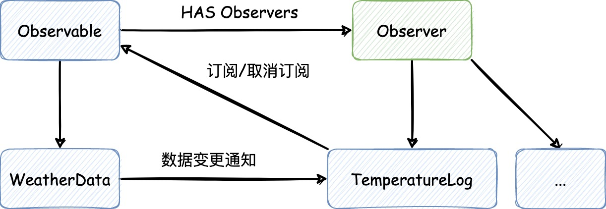

## 《Head First 设计模式》及一些应用示例

- **随时想到系统以后可能需要的变化以及应付变化的原则**
- 良好的OO设计必须具备可复用、可扩充、可维护三个特性

## 1. 设计原则
1. 找出应用中**可能需要变化之处**，把它们**独立出来**，**不要和那些不需要变化的代码混在一起**
2. **面向接口编程**，而不是面向实现编程
> 接口是Java中的`interface`，当然这里强调的不是它，而是 **"概念"**，面向接口编程强调的是**多态**。这就类似在Spring中注入的bean是具体实现，
> 但是它们的引用却是接口，这样声明的字段不用管注入的是谁，直接调用方法即可，而且可以在运行时改变实现类型，"切换不同的策略"。

3. 多用组合，少用继承
4. 为**松耦合**的实现努力
## 2. 策略模式
> **策略模式**定义了算法族，分别封装起来，让它们之间可以互相替换。我理解的是在Spring中，一个Bean有多种实现，在注入时我们可以选择注入想要的实现。

策略模式代码示例在 chapter1 包下

## 3. 观察者模式
> **观察者模式**定义了对象之间一对多的关系（主题对多个观察者），这样一来，当主题改变状态时，它的所有观察者都会收到通知。
> 主题和观察者对象是**松耦合**的，因为主题唯一依赖的东西是一个实现了 `Observer` 接口的观察者对象列表，在运行时可以用新的观察者替换旧的观察者，
> 主题的代码不需要改变

观察者模式代码示例在 chapter2 包下，通过JDK内置的 `Observable` 和 `Observer` 来实现。
但是JDK提供的现成的观察者组件也有它自己的问题：
- `Observable`是一个**类**，这也就导致了必须创建一个类来实现的， 而且Java是单继承的，所以要想再继承其他类的功能是行不通的
- `Observable`中`setChanged()`的方法是被`protected`修饰的，这也就导致了，我们没有办法通过**组合**Observable实例到我们自己的对象中来实现
想要的功能。这也违反了**多用组合，少用继承**的原则

