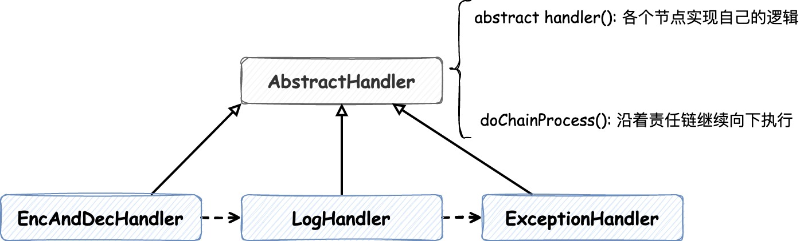

## 《Head First 设计模式》及一些应用示例

- **随时想到系统以后可能需要的变化以及应付变化的原则**
- 良好的OO设计必须具备可复用、可扩充、可维护三个特性
- 代码应该如同晚霞中的莲花一样地关闭（免于改变），如同晨曦中的莲花一样地开放（能够扩展）

## 1. 设计原则
1. 找出应用中**可能需要变化之处**，把它们**独立出来**，**不要和那些不需要变化的代码混在一起**
2. **面向接口编程**，而不是面向实现编程
> 接口是Java中的`interface`，当然这里强调的不是它，而是 **"概念"**，面向接口编程强调的是**多态**。这就类似在Spring中注入的bean是具体实现，
> 但是它们的引用却是接口，这样声明的字段不用管注入的是谁，直接调用方法即可，而且可以在运行时改变实现类型，"切换不同的策略"。

3. 多用组合，少用继承
4. 为**松耦合**的实现努力
5. **开放-关闭原则**: 类应该对扩展开放，对修改关闭
## 2. 策略模式
> **策略模式**定义了算法族，分别封装起来，让它们之间可以互相替换。我理解的是在Spring中，一个Bean有多种实现，在注入时我们可以选择注入想要的实现。

- 策略模式代码示例在 chapter1 包下

## 3. 观察者模式
> **观察者模式**定义了对象之间一对多的关系（主题对多个观察者），这样一来，当主题改变状态时，它的所有观察者都会收到通知。
> 主题和观察者对象是**松耦合**的，因为主题唯一依赖的东西是一个实现了 `Observer` 接口的观察者对象列表，在运行时可以用新的观察者替换旧的观察者，
> 主题的代码不需要改变

- 观察者模式代码示例在 chapter2 包下，通过JDK内置的 `Observable` 和 `Observer` 来实现。

但是JDK提供的现成的观察者组件也有它自己的问题：
1. `Observable`是一个**类**，这也就导致了必须创建一个类来实现的， 而且Java是单继承的，所以要想再继承其他类的功能是行不通的
2. `Observable`中`setChanged()`的方法是被`protected`修饰的，这也就导致了，我们没有办法通过**组合**Observable实例到我们自己的对象中来实现
想要的功能。这也违反了**多用组合，少用继承**的原则

### 3.1 zookeeper中watch机制使用的观察者模式
如下图所示，客户端在调用`getData()`方法的时候会对指定的路径添加观察者，保存在 **"主题"** 中，path发生改变后通知这些观察者

- 代码示例在 chapter2/zookeeper 下

## 4. 装饰器模式
> **装饰器模式**能够**动态地**在被装饰者的方法调用**之前/之后**加上新的执行逻辑。装饰者和被装饰者有**相同的超类**，
> 每个装饰者中都 **"包装"一个超类的引用**，以保存某个被装饰者，也因此能够在运行时动态地来更换装饰者。
> 但是它的**缺点是有很多小类**，使得代码复杂度增加

- 代码示例在 chapter3/decorator 下，类关系和调用关系如下图所示

### 4.1 Java I/O 对装饰器模式的应用
**Java IO** 对装饰器模式的使用和上方的例子类似，类关系图如下，它们公共的超类是 `InputStream`

- 代码示例在 chapter3/javaio 下，写了一个将字符小写处理的输入流**装饰器**

## 15. 责任链模式
> **责任链模式**可以实现多个对象对请求进行处理，而且是将请求和请求的处理者**解耦**：请求的发送者无需关心处理的细节和请求的传递，只需将请求发送到责任链上即可

### 15.1 工作中对责任链模式的使用
项目开放外部接口调用，请求进来都有一套必走的逻辑，如下

通过使用Spring的AOP切面技术并结合责任链模式，能够**按顺序**将以上处理节点进行封装，按需对请求进行处理，满足业务需求并达到**解耦**的目的

- 代码示例在 chapter15 下，结构如下图所示

### 15.2 zookeeper对责任链模式的使用

zookeeper在处理create请求时，会封装一条如上图所示的责任链（理解流程需要了解zookeeper相关知识）

- **LeaderRequestProcessor**: 校验工作
- **PrepRequestProcessor**: 请求入队
- **ProposalRequestProcessor**: 两阶段提交的proposal阶段
- **SyncRequestProcessor**: 将数据写入本地事务文件
- **CommitProcessor**: 等到过半ack后，处理接下来的节点任务
- **ToBeAppliedRequestProcessor**: do noting
- **FinalRequestProcessor**: 将数据写到内存 Map 中
