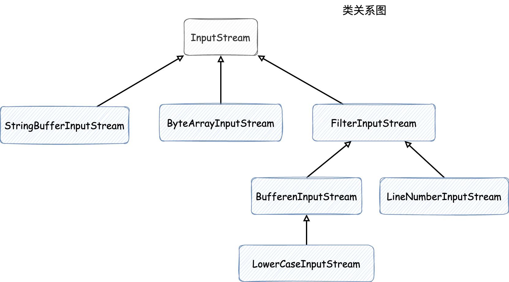
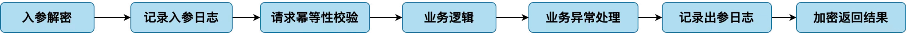

## 《Head First 设计模式》及一些应用示例
> **设计模式**是在某种情景下，针对某问题的某种解决方案

- **随时想到系统以后可能需要的变化以及应付变化的原则**
- **所有的原则都应该在有帮助的时候才遵守**
- **所有的设计都不免需要折中**
- 良好的OO设计必须具备可复用、可扩充、可维护三个特性
- 代码应该如同晚霞中的莲花一样地关闭（免于改变），如同晨曦中的莲花一样地开放（能够扩展）

## 1. 设计原则
1. 找出应用中**可能需要变化之处**，把它们**独立出来**，**不要和那些不需要变化的代码混在一起**
2. **面向接口编程**，而不是面向实现编程
> 接口是Java中的`interface`，当然这里强调的不是它，面向接口编程强调的是**多态**。

3. 多用组合，少用继承
4. 为**松耦合**的实现努力
5. **开放-关闭原则**: 类应该对扩展开放，对修改关闭
6. **依赖倒置原则**: 依赖抽象，不要依赖具体实现类
> 依赖倒置原则变量不持有具体实现类的引用，可以改用工厂模式来代替。这就类似在Spring中注入的bean是具体实现，但是它们的引用却是接口，这样声明的字段不用管注入的是谁，直接调用方法即可，而且可以在运行时改变实现类型，"切换不同的策略"。

7. 只和你的密友谈话: 减少类的耦合（Spring开发时注入的bean的数量应该尽可能得到控制）
> 这个原则会减少软件的维护成本，但是也会造成更多的包装类被创建出来，以处理和其他组件的沟通，这会增加系统复杂度和开发时间，并降低运行时性能
8. 避免循环依赖
9. **单一职责(SRP)**: 尽可能让每个类保持单一的责任，当一个模块或一个类被设计成只支持一组相关的功能时，我们称它为高内聚，
反之，当被设计成支持一组不相关的功能时，我们称它为低内聚（内聚用来衡量一个类或模块紧密地达到单一职责）


## 2. 策略模式
> **策略模式**定义了算法族，分别封装起来，让它们之间可以互相替换。我理解的是在Spring中，一个Bean有多种实现，在注入时我们可以选择注入想要的实现。

- 策略模式代码示例在 chapter2 包下

### 2.1 MVC
视图和控制器实现了经典的策略模式，视图可以被调整使用不同的策略，而控制器提供了不同的策略。视图只关心系统中可视的部分，对于任何界面行为，
都委托给控制器处理。

## 3. 观察者模式
> **观察者模式**定义了对象之间一对多的关系（主题对多个观察者），这样一来，当主题改变状态时，它的所有观察者都会收到通知。
> 主题和观察者对象是**松耦合**的，因为主题唯一依赖的东西是一个实现了 `Observer` 接口的观察者对象列表，在运行时可以用新的观察者替换旧的观察者，
> 主题的代码不需要改变

- 观察者模式代码示例在 chapter3 包下，通过JDK内置的 `Observable` 和 `Observer` 来实现，类图如下
  

但是JDK提供的现成的观察者组件也有它自己的问题：
1. `Observable`是一个**类**，这也就导致了必须创建一个类来继承， 而且Java是单继承的，所以要想再继承其他类的功能是行不通的
2. `Observable`中`setChanged()`的方法是被`protected`修饰的，这也就导致了，我们没有办法通过**组合**Observable实例到我们自己的对象中来实现
想要的功能。这也违反了**多用组合，少用继承**的原则

### 3.1 zookeeper中watch机制使用的观察者模式
如下图所示，客户端在调用`getData()`方法的时候会对指定的路径添加观察者，保存在 **"主题"** 中，path发生改变后通知这些观察者


- 代码示例在 chapter3/zookeeper 下

### 3.2 MVC
Model使用了观察者模式，当模型的状态发生改变时，所有的观察者将被通知：Views and Controllers.

## 4. 装饰器模式
> **装饰器模式**能够**动态地**在被装饰者的方法调用**之前/之后**加上新的执行逻辑。装饰者和被装饰者有**相同的超类**，
> 每个装饰者中都 **"包装"一个超类的引用**，以保存某个被装饰者，也因此能够在运行时动态地来更换装饰者。
> 但是它的**缺点是有很多小类**，使得代码复杂度增加

- 代码示例在 chapter4/decorator 下，类关系和调用关系如下图所示


### 4.1 Java I/O 对装饰器模式的应用
**Java IO** 对装饰器模式的使用和上方的例子类似，类关系图如下，它们公共的超类是 `InputStream`



- 代码示例在 chapter4/javaio 下，写了一个将字符小写处理的输入流**装饰器**

## 5. 工厂模式
- **所有工厂模式都是用来封装对象创建的**，它是对**依赖倒置原则**很好的体现，使用的是抽象类型，
而无需关注具体的子类，具体返回的类型由子类来决定，也因此促进**松耦合**

### 5.1 简单工厂
简单工厂**其实不是一个设计模式**，它更像是一个**编程习惯**，把**创建对象的代码包装进一个类中**，当创建对象的逻辑需要发生改变时，
只需要修改这个简单工厂类即可（对应设计原则的第一条）

- 代码示例在 chapter5/simple 下，对应的类的继承和组合关系如下
  

实际完成的代码抽取动作如下


### 5.2 工厂方法模式
> **工厂方法模式**定义抽象的工厂方法，通过让**子类**实现该方法来定制化实现对象的创建，以达到封装创建对象代码的目的

- 代码示例在 chapter5/factorymethod 下，对应的类继承和组合关系如下，主要有两大类：**创建者类**和**产品类**
  

创建者抽象类通常会依赖抽象的产品类，而这些抽象的产品对象由子类创建，创建者不关心具体的类型

### 5.3 抽象工厂模式
> **抽象工厂模式**定义一个**接口**，用来**创建一大组相关的对象**，而不需要指定对象具体的类型，也就是说工厂方法的返回值对象也是抽象的。

先看一组类图，"各地不同的原料工厂创建各地的食材"，如下


`IngredientsFactory` 定义接口，包含两个方法，用来创建对象: `Cheese` 和 `Veggie`。`ChinaIngredientsFactory` 和
`UKIngredientsFactory` 做具体实现，来创建各地不同的食材。

- 代码示例在 chapter5/abstractfactory 下

为什么要使用抽象工厂模式？

因为**各地的**披萨店需要**各地的**食材来做披萨，而食材中**包含多种食材**，
这样我们就必须要使用抽象工厂模式来**创建一批食材对象**。

### 5.4 工厂模式和抽象工厂模式的区别

- **实现不同**
  - **工厂方法模式**: 通过**继承**来重写**单个工厂方法**
  - **抽象工厂模式**: 定义一个**接口**，由不同的子类实现**多个工厂方法**，创建一系列相关的对象

## 6. 单例模式
> **单例模式**确保**一个类只有一个实例**，并提供一个全局的访问点

- 构造器私有
- 公开出静态方法创建对象
- 双重检测锁机制注意标记volatile

### 6.1 饿汉式
如果应用程序总是创建并使用该单例对象。或者在创建和运行时方面的负担不太繁重，可以**急迫地**创建该单例

```java
/**
 * 饿汉式单例模式
 */
public class Singleton {
    private static final Singleton singleton = new Singleton();

    private Singleton() {
    }
    
    public static Singleton getInstance() {
        return singleton;
    }
}
```

**JVM保证在任何线程访问 `singleton` 静态变量之前，一定先创建此实例**

### 6.2 懒汉式
如果程序**可以接受**同步的getInstance方法造成的额外负担，那么可以采用如下的方法

```java
/**
 * 懒汉式单例模式
 */
public class Singleton {
    private static Singleton singleton = null;

    private Singleton() {
    }
    
    public static synchronized Singleton getInstance() {
        if (singleton == null) {
            singleton = new Singleton();
        }
        
        return singleton;
    }
}
```

### 6.3 双重检测锁
如果想在用到时才创建对象且运行时比较关注性能的话，可以采用这种机制，因为在该对象创建完成后，便不会再有加锁操作出现了

```java
/**
 * 双重检测锁单例模式
 */
public class Singleton {

    private static volatile Singleton singleton;

    private Singleton() {
    }

    public static Singleton getInstance() {
        if (singleton == null) {
            synchronized (Singleton.class) {
                if (singleton == null) {
                    singleton = new Singleton();
                }
            }
        }

        return singleton;
    }
}
```
- volatile关键字确保 `singleton` 对象被创建后其他线程能及时的知道

## 7. 命令模式
> **命令模式**将请求封装成对象，以便使用不同的请求，并且支持撤销操作，也可以定义宏命令来执行多个命令的操作。

命令模式类图关系如下，


- 调用者持有命令对象，并可以在调用`doAnything()`方法的时候来调用命令的`execute()`方法
- 命令对象的具体实现中包含真正的命令执行者，它可以是任何我们想要的类，在`execute()`方法中执行想要的逻辑
- 代码示例在 chapter7 下

### 7.1 命令模式在队列异步缓冲的应用


如上图所示，可以在业务执行中，将记录log等其他操作命令放入一个命令队列中，这样开启多个线程在命令队列中消费，它不必关注什么命令，
直接执行`execute()`方法即可。这样能将业务主流程和其他任务**解耦**同时**提高性能**

## 8. 适配器模式
> **适配器模式**将一个类的接口转换成客户期望的另一个接口，适配器可以让原本不兼容的类可以合作无间

- **实现**目标接口（一个或多个）
- 通过**组合**的方式，将**被适配者**（一个或多个）保存在**适配器**中，调用时不关注被适配者是谁，直接使用调用适配器方法即可，实现了**解耦**

类图和代码示例类关系如下图


注意适配器的命名风格: **被适配者 + Adapter**，实现的是目标接口

- 代码示例在 chapter8 下

## 9. 外观模式
> **外观模式**组合许多类并公开出**简单**方法，来**简化**这些所包含的类的调用，并且使调用者和这些被包含的子系统**解耦**
> （这个感觉和平时开发时在bean中注入许多其他bean，并公开出简单方法供调用是一样的）


## 10. 模板方法模式
> **模板方法模式**定义一个算法骨架为模板方法，而将其中的一些步骤定义为抽象，并由子类负责去实现，子类在不改变算法步骤的情况下，来完成个性化的算法实现

- 模板方法声明为`final`，这样它就没办法被重写，以作为通用的模板方法来使用

### 10.1 模板方法模式中的钩子方法
> **钩子方法**是一种被**声明在抽象类**中的方法，是**空方法**或者仅有**默认实现**，钩子方法能够作为条件控制来影响算法的流程，
> 但是要不要挂钩，由子类自己决定。抽象方法**必须**由子类去实现，而钩子方法由子类**选择**去实现

- 代码示例在 chapter10 下，对应类图如下
  

### 10.2 Arrays.sort() 对模板方法模式的应用

```
public static void sort(Object[] a) {
    Object[] aux = (Object[]) a.clone();
    // 注意往下看这里
    mergeSort(aux, a, 0, a.length, 0);
}

private static void mergeSort(...) {
    ...
                               // 注意看这里对Comparable.compareTo的使用
    for (int j = i; j < low && ((Comparable)dest[j - 1]).compareTo((Comparable)dest[j]) > 0; j--) {
        ...
    }
    ...
}
```

这个排序的静态方法，注意其中依赖`Comparable.compareTo()`方法。这就需要让子类去实现 `Comparable` 接口才能完成比较，
整个排序方法的模板已经写好了**作为模板方法**， 而这一步**比较的方式**相当于是子类自己去做具体的实现，如此也是模板方法设计模式的使用

- 代码示例在 chapter10/sort 下

## 11. 迭代器模式
> **迭代器模式**提供顺序访问集合内各个对象的方法，而不暴露出该集合是如何实现的（数组、列表、散列表等等），把遍历的任务交给迭代器而不是集合本身

- 代码示例在 chapter11 下，结构图如下

每个菜单创建了自己的迭代器，把具体保存对象的集合藏起来，对外开放给`Waitress`调用时，方法都是通用的，而它也不关心背后是如何保存数据的

## 12. 组合模式
> **组合模式**能让我们将数个对象组合成**树**的结构，每个树节点包含了要保存的元素和其他节点。
> 大多数情况下可以将元素对象和节点对象实现同一个接口来使其具有一致性。（它们之间有 整体/部分，包含被包含的关系，并且想用一致的方法对待它们时）

- 代码示例在 chapter12 下，结构图如下，示例中菜单中可能包含子菜单，而每个菜单中又可以包含很多个菜品，这样使用组合模式把它们组合在一起


组合模式和迭代器模式可以一起应用，对整颗树的遍历的迭代器可以看看 `MenuIterator`

### 12.1 MVC
View采用组合模式，显示包含了窗口、面板、按钮和文本标签等，每个视图组件不是组合节点就是叶节点

## 13. 状态模式
> **状态模式**允许对象在内部**状态改变时修改它的行为**，对象**看起来**像是修改了自己的代码。
> 区别于策略模式，策略模式是调用者主动的切换不同的策略对象，而状态模式是随着变化，状态自己在内部发生变化

- 代码示例在 chapter13 下，类结构图如下


## 14. 代理模式（动态代理）
> **代理模式**为另一个对象提供一个代理以**控制对这个对象的访问**。
> 与装饰器模式的区别：装饰器模式强调的是在被装饰对象上增加一些功能，而代理模式强调对对象的控制，不对对象本身做加强，而是去做一些**对象本身不关心的事情**

- 代码实例在 chapter14，类图和流程说明如下图


`InvocationHandler`的作用是响应Proxy的方法调用，可以理解为代理调用方法之后实际工作的对象

## 15. 责任链模式
> **责任链模式**可以实现多个对象对请求进行处理，而且是将请求和请求的处理者**解耦**：请求的发送者无需关心处理的细节和请求的传递，只需将请求发送到责任链上即可

### 15.1 工作中对责任链模式的使用
项目开放外部接口调用，请求进来都有一套必走的逻辑，如下



通过使用Spring的AOP切面技术并结合责任链模式，能够**按顺序**将以上处理节点进行封装，按需对请求进行处理，满足业务需求并达到**解耦**的目的

- 代码示例在 chapter15 下，结构如下图所示


### 15.2 zookeeper对责任链模式的使用


zookeeper在处理create请求时，会封装一条如上图所示的责任链（理解流程需要了解zookeeper相关知识）

- **LeaderRequestProcessor**: 校验工作
- **PrepRequestProcessor**: 请求入队
- **ProposalRequestProcessor**: 两阶段提交的proposal阶段
- **SyncRequestProcessor**: 将数据写入本地事务文件
- **CommitProcessor**: 等到过半ack后，处理接下来的节点任务
- **ToBeAppliedRequestProcessor**: do noting
- **FinalRequestProcessor**: 将数据写到内存 Map 中

## 复合模式
> 复合模式结合两个或以上的模式，组成一个解决方案来解决一般性问题。MVC就是复合模式，组合了策略模式、组合模式和观察者模式。
